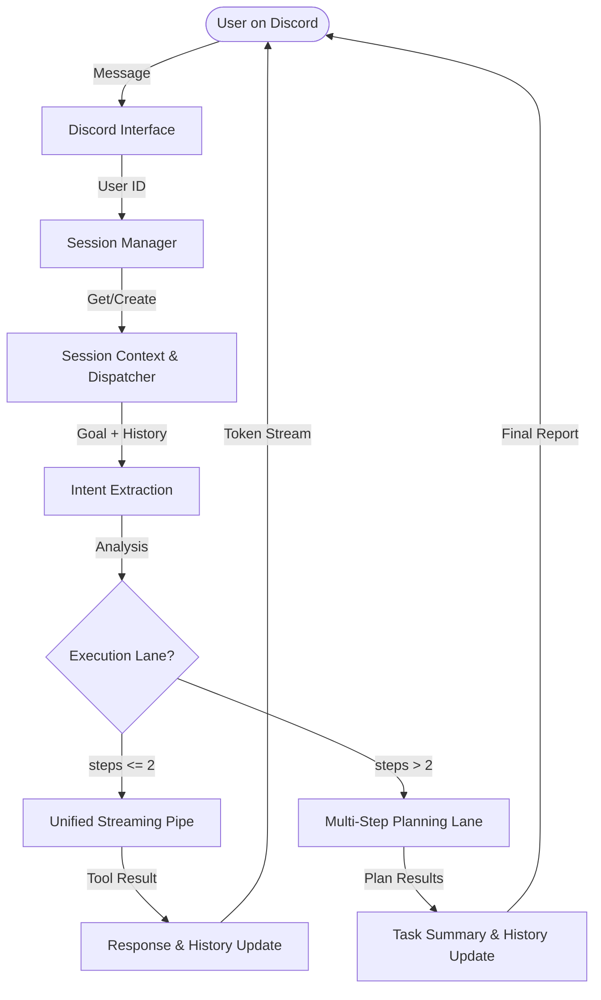
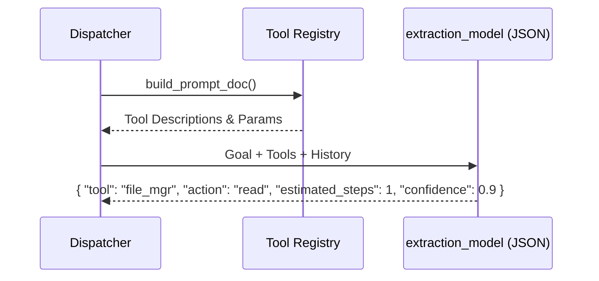
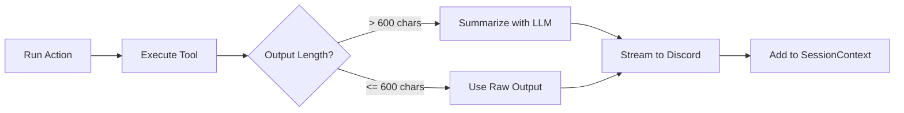
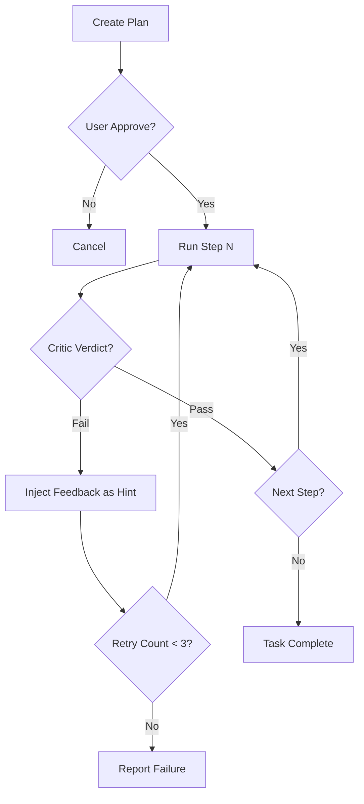
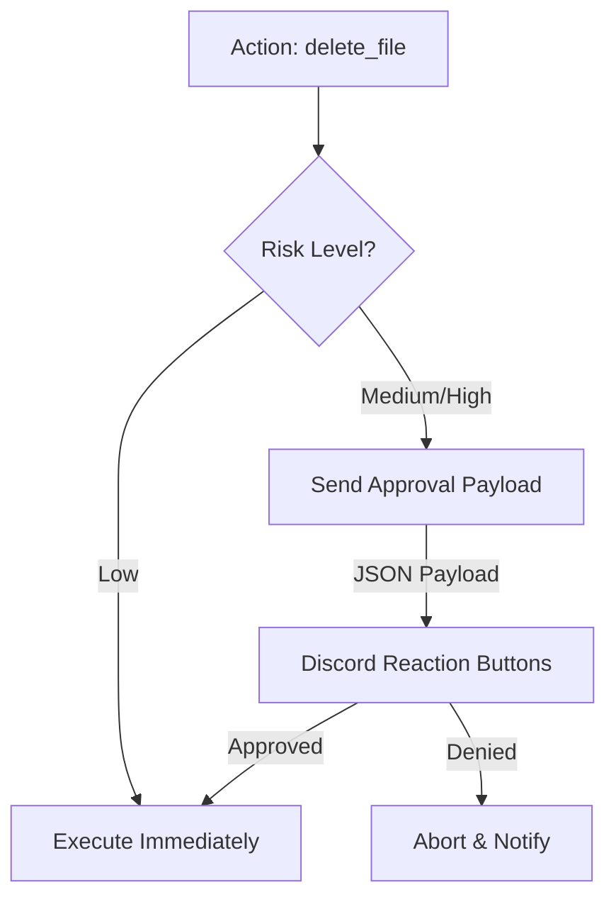
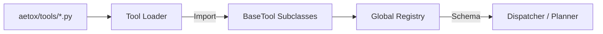

# 🧠 AetoxClaw: Algorithms & Flowcharts (Deep Dive)

เอกสารฉบับนี้อธิบายอัลกอริทึมและตรรกะการทำงานภายในของ **AetoxClaw** (Agentic Local OS Orchestrator) อย่างละเอียดที่สุด โดยอ้างอิงจากโครงสร้างโค้ดจริงในปัจจุบัน

---

## 1. High-Level System Flow (The Big Picture)

AetoxClaw ทำงานบนสถาปัตยกรรม **Stateless Core** โดยมี Discord เป็น Interface หลัก ระบบจะจัดการทรัพยากรแยกตาม User ID ผ่าน `SessionManager`



---

## 2. Intent Extraction & Dynamic Tool Discovery

หัวใจของการวิเคราะห์เจตนาไม่ใช่การใช้ `if-else` แต่เป็นการใช้ **Tool Schema Injection** เพื่อให้โมเดลเข้าใจความสามารถของระบบแบบ Real-time

### Algorithm: Schema-Based Extraction
1.  **Registry Scan**: ระบบโหลดเครื่องมือทั้งหมดจาก `aetox/tools/`
2.  **Schema Generation**: แปลง Class Methods เป็น JSON Schema (Prompt-friendly)
3.  **Context Injection**: ฉีด Schema + ประวัติล่าสุด (3-5 รอบ) เข้าไปใน Prompt
4.  **LLM Reasoning**: โมเดลวิเคราะห์ว่าควรใช้เครื่องมือใด พร้อมประมาณการจำนวนขั้นตอน (`estimated_steps`)



---

## 3. Unified Streaming Pipeline (Single-Action Lane)

เมื่อระบบวิเคราะห์แล้วว่างานไม่ซับซ้อน จะเข้าสู่เลนการทำงานที่เร็วที่สุด พร้อมระบบสรุปเนื้อหาอัตโนมัติ



---

## 4. Multi-Step Planning Lane (The Dispatcher Loop)

สำหรับงานที่ต้องทำหลายขั้นตอน ระบบจะใช้ `AetoxPlanner` สร้างแผนงาน และรันผ่าน **Feedback-Loop** โดยมี **Critic** คอยตรวจสอบ

### Algorithm: Dispatcher Loop with Critic
1.  **Planning**: สร้างลิสต์ของขั้นตอน (Steps) พร้อมเหตุผล
2.  **Execution**: รัน Executor ทีละขั้นตอน
3.  **Evaluation**: ส่งผลลัพธ์ให้ **Critic Agent** ตรวจสอบ (Pass/Fail)
4.  **Feedback & Retry**: หากไม่ผ่าน จะนำ Feedback จาก Critic ไปเป็น "Hint" ในการลองใหม่ (สูงสุด 3 ครั้ง)



---

## 5. Memory Compression Algorithm (3-Level Context)

AetoxClaw ใช้หลักการ **Stateless History Injection** เพื่อประหยัด Token และรองรับโมเดลขนาดเล็ก (7B-9B)

| ระดับ | ข้อมูล | การจัดการ | ตัวอย่าง |
| :--- | :--- | :--- | :--- |
| **1. Critical** | Goal, Plan ID, Root Path | **เก็บตลอด** จนจบ Task | `global_goal` |
| **2. Context** | Step Results, Chat History | **สรุป (Summarize)** หรือตัดให้สั้น | `plan_summary` |
| **3. Discard** | Raw Logs, Metadata, Temp Files | **ทิ้งทันที** หลังจบขั้นตอน | Raw JSON response |

### Token Budget Manager
- **Sliding Window**: เก็บ Chat History แค่ 5 ล่าสุด (ตั้งค่าได้ใน `SessionContext`)
- **Truncation**: ตัดความยาว Output ของเครื่องมือเหลือ 200-500 ตัวอักษรก่อนบันทึกลงความจำ

---

## 6. Safety Layer: Permission & Sandbox

ระบบความปลอดภัยแบ่งตามความเสี่ยง (Risk Levels) โดยใช้ `config/permissions.yaml` เป็นเกณฑ์

### Risk Assessment Logic


**Approval Payload Example:**
```json
{
  "action": "delete_file",
  "details": "Deleting 'logs/old_data.txt' in sandboxed directory",
  "risk": "HIGH",
  "path": "e:/Aetox/AetoxOS/logs/old_data.txt"
}
```

---

## 7. Tool Registry Flow (Dynamic Loading)

การเพิ่มความสามารถใหม่ให้ AetoxClaw ทำได้แบบ **Zero Configuration** ผ่านระบบ Registry



---

## 8. Error Recovery & Escalation

หากระบบติด Loop หรือแก้ปัญหาไม่ได้ในเลนปกติ จะมีการยกระดับ (Escalation):
- **Retry**: พยายามแก้ไขจุดผิดพลาดเดิมตามคำแนะนำของ Critic
- **Feedback Injection**: ส่ง Feedback กลับไปที่ Planner เพื่อปรับแผน (ถ้าจำเป็น)
- **User Hand-off**: หากล้มเหลวครบโควตา จะหยุดและสรุปปัญหาให้ผู้ใช้ช่วยตัดสินใจ

---
*Document Version: 2026.05.06 | Real-time Alignment with AetoxClaw Codebase*
